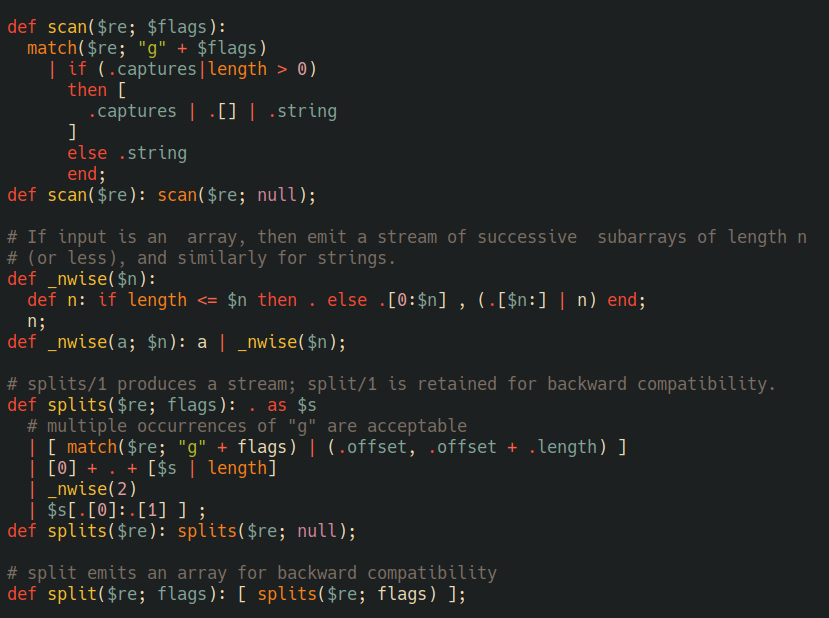

# Jq Major Mode using tree-sitter

[](https://www.gnu.org/licenses/gpl-3.0)

This package provides  a major-mode for jq using the  tree-sitter grammar for Jq
from [tree-sitter-jq](https://github.com/nverno/tree-sitter-jq).

Features:
- indentation
- font-locking
- imenu
- structural navigation with treesitter objects



For a major-mode without tree-sitter see [jq-mode](https://github.com/ljos/jq-mode).

## Installing

Emacs 29.1 or above with tree-sitter support is required. 

Tree-sitter starter guide: https://git.savannah.gnu.org/cgit/emacs.git/tree/admin/notes/tree-sitter/starter-guide?h=emacs-29

### Install tree-sitter parser for jq

Add the source to `treesit-language-source-alist`. 

```elisp
(add-to-list
 'treesit-language-source-alist
 '(jq "https://github.com/nverno/tree-sitter-jq"))
```

Then run `M-x treesit-install-language-grammar` and select `jq` to install the
shared library.

### Install jq-ts-mode from melpa

`M-x package-install jq-ts-mode`

### Install jq-ts-mode.el from source

- Clone this repository
- Add the following to your emacs config

```elisp
(require "[cloned nverno/jq-ts-mode]/jq-ts-mode.el")
```

### Troubleshooting

If you get the following warning:

```
⛔ Warning (treesit): Cannot activate tree-sitter, because tree-sitter
library is not compiled with Emacs [2 times]
```

Then you do not have tree-sitter support for your emacs installation.

If you get the following warnings:
```
⛔ Warning (treesit): Cannot activate tree-sitter, because language grammar for jq is unavailable (not-found): (libtree-sitter-jq libtree-sitter-jq.so) No such file or directory
```

then the jq grammar file is not properly installed on your system.
